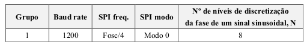
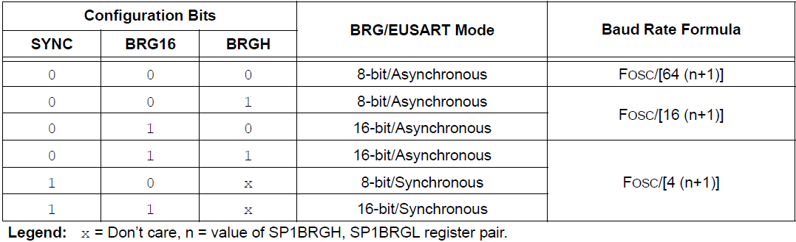
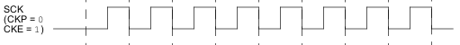
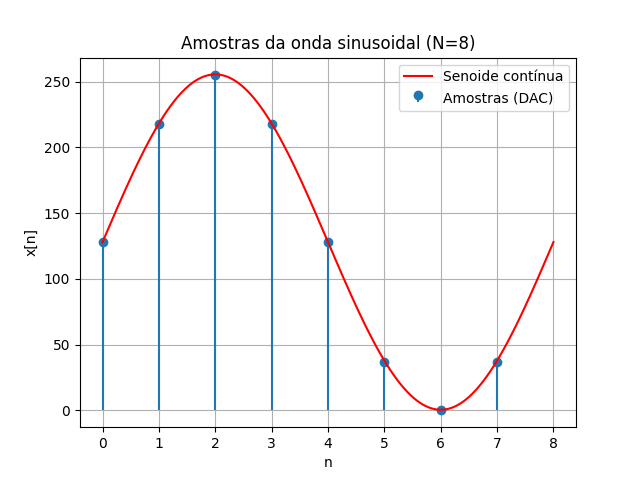

# embedded-lab2-dac-uart-spi



| add | name     | hex    | decimal | binary            | char |
| --- | -------- | ------ | ------- | ----------------- | ---- |
| 19E | TX1STA   | 0x26   | 38      | 00100110          | '&'  |
| 19F | BAUD1CON | 0x48   | 72      | 01001000          | 'H'  |
| 19B | SP1BRG   | 0x0340 | 832     | 00000011 01000000 | '.@' |
| 19C | SP1BRGH  | 0x03   | 3       | 00000011          | '.'  |
| 19B | SP1BRGL  | 0x40   | 64      | 01000000          | '@'  |
| 19A | TX1REG   | 0x61   | 97      | 01100001          | 'a'  |

| Addr. | Name     | Bit 7  | Bit 6 | Bit 5 | Bit 4 | Bit 3 | Bit 2 | Bit 1 | Bit 0 | Value on POR, BOR | Value on all other Resets |
| ----- | -------- | ------ | ----- | ----- | ----- | ----- | ----- | ----- | ----- | ----------------- | ------------------------- |
| 19Eh  | TX1STA   | CSRC   | TX9   | TXEN  | SYNC  | SENDB | BRGH  | TRMT  | TXD   | 0000 0010         | 0000 0010                 |
| 19Fh  | BAUD1CON | ABDOVF | RCIDL | —     | SCKP  | BRG16 | —     | WUE   | ABDEN | 01-0-0-00         | 01-0-0-00                 |

TX1STA.SYNC = 0 // bit 4

TX1STA.BRGH = 1 // bit 2

BAUD1CON.BRG16 = 1 // bit 3



In our case:

BRG/EUSART Mode: 16-bit/Asynchronous
Baud Rate Formula: Fosc / [4 (n+1)]

n = SP1BRGH, SP1BRGL = 832

Fosc = 4MHz_HF

Effective Baud Rate = 4 _ 10⁶ / (4 _ 833) = 1200,480192077

1200,480192077 / 1200 = 0,00040016 = 0,040016%

TX1REG = 0x61 - > Because at the end of the loop the function EUSART_Write('a') loads the ASCII value of the character 'a' (0x61) into the TX1REG register, preparing it to be transmitted over UART.

RX1 amplitude 13.2V (amarelo)
RC7(RX) = 5.2V (azul)

| Start | 1º bit | 2º bit | 3º bit | 4º bit | 5º bit | 6º bit | 7º bit | 8º bit | Stop |
| ----- | ------ | ------ | ------ | ------ | ------ | ------ | ------ | ------ | ---- |
| 0     | 1      | 0      | 0      | 0      | 1      | 1      | 0      | 0      | 1    |

Tbaud = 800 micro segundos \* 10 = 8ms

## Comunicação série síncrona (SPI)

215 SSP1CON1 0x20 32 00100000 | CKP 0

214 SSP1STAT 0x40 64 01000000 | CKE 1

• MSSP STATUS register (SSP1STAT)
• MSSP Control register 1 (SSP1CON1)

SSP1CON1 and SSP1STAT are the control and STA-
TUS registers in SPI mode operation. The SSP1CON1
register is readable and writable. The lower six bits of
the SSP1STAT are read-only. The upper two bits of the
SSP1STAT are read/write.

When the CKE bit is set, the SDO data is valid before
there is a clock edge on SCK.

The clock polarity is selected by appropriately
programming the CKP bit of the SSP1CON1 register
and the CKE bit of the SSP1STAT register.

SPI: Modo 0

215 SSP1CON1 0x20 32 00100000 | CKP 0

214 SSP1STAT 0x40 64 01000000 | CKE 1

Caraterísticas deste modo:

- o transmissor envia os dados no flanco descendente do clock (linhas a vermelho)
- o recetor deve capturar os bits no flanco oposto à transmissão ('0' → '1') (linhas a
  verde)
- A polaridade do clock no modo idle é '0' (bit CKP = '0')
- A transmissão ocorre na transição de ativo ('1') para modo
  idle ('0') (bit CKE = '1')



## void SPI_WriteByte(uint8_t byte)

The SSP1BUF holds the data that was written to
the SSP1SR until the received data is ready. Once the
eight bits of data have been received, that byte is
moved to the SSP1BUF register.

| add | name    | hex  | decimal | binary   | char |
| --- | ------- | ---- | ------- | -------- | ---- |
| 211 | SSP1BUF | 0x31 | 49      | 00110001 | '1'  |


# Conversor Digital-Analógico (DAC)


To calculate the 𝑥[𝑛] that will serve as input of the DAC we use the following script:
```
import math

N = 8
x = []

for n in range(N):
    valor = 128 + 127.5 * math.sin(2 * math.pi * n / N)
    x.append(int(valor))

print("Vetor x:", x)
```

int x[8]= {128, 218, 255, 218, 128, 37, 0, 37};





We have samples every 500 us.

Sampling frequency is the inverse of time between samples:

$$
T_s = 500\,\mu s = 500 \times 10^{-6} s
$$

**a) Valores do vetor x**
Para $N = 8$, os valores obtidos da equação

$$
x[n] = \text{trunc}\left(128 + 127.5 \cdot \sin\left(\frac{2\pi}{N} n\right)\right)
$$

são:

$$
x = \{128, 218, 255, 218, 128, 37, 0, 37\}
$$

---

**b) Frequência do sinal e frequência de amostragem**

No código:

```c
__delay_us(500);
```

indica que o intervalo de amostragem é de **500 µs**.

* **Período de amostragem:**

$$
T_s = 500\,\mu s = 500 \times 10^{-6} s
$$

* **Frequência de amostragem:**

$$
f_s = \frac{1}{T_s} = \frac{1}{500 \times 10^{-6}} = 2000\,Hz
$$

Como são necessárias $N = 8$ amostras para completar um ciclo da senoide:

* **Frequência do sinal de saída:**

$$
f_{sinal} = \frac{f_s}{N} = \frac{2000}{8} = 250\,Hz
$$

# First 3 non null frequencies

1º 230Hz

2º 1.645kHz

3º 2.120kHz
